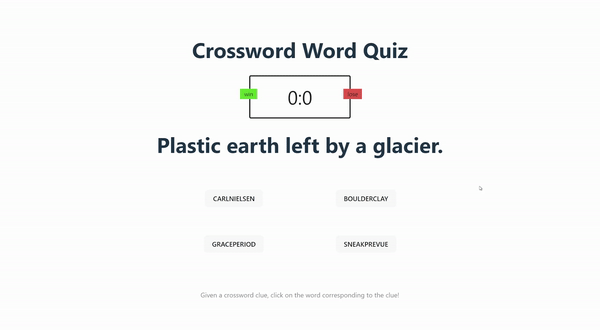

# Crossword-Word-Learner
Quiz yourself with the crossword word learner! This React based website generates a random crossword clue from a 6-million entry database as well as four words (one correct, and the other three incorrect). Match the crossword clue to the corresponding crossword word/solution.

## Installation

> **To get started:** Clone this repository using
> 
>   `git clone https://github.com/mmaciesowicz/Crossword-Word-Learner`
>

Next, install package dependencies using [npm](https://nodejs.org/en/download):
>
>   `npm install`
>

Run the program:
>
>   `npm run dev`
>

Build the program for production:
>
>   `npm run build`
>
